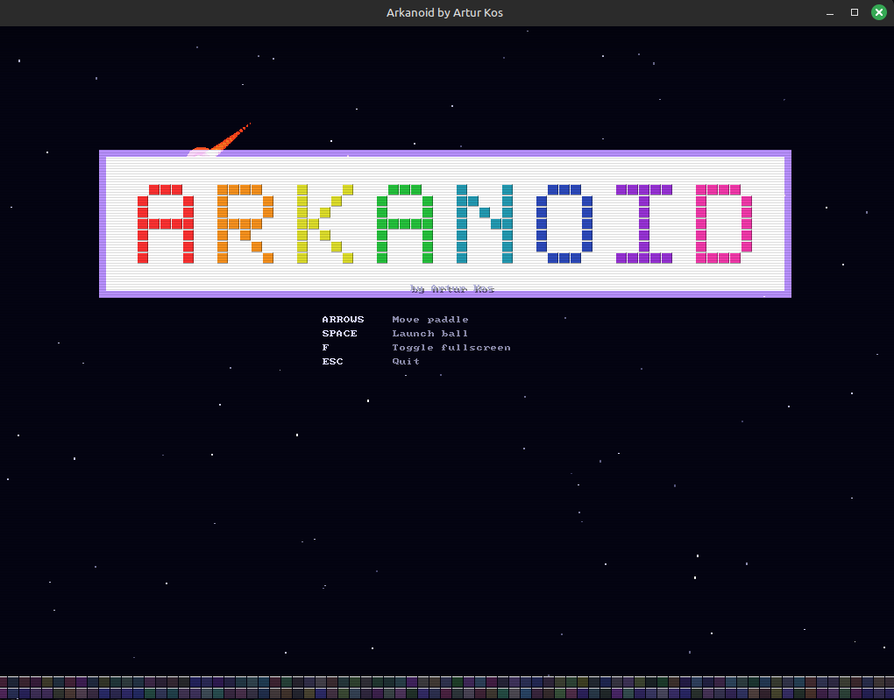
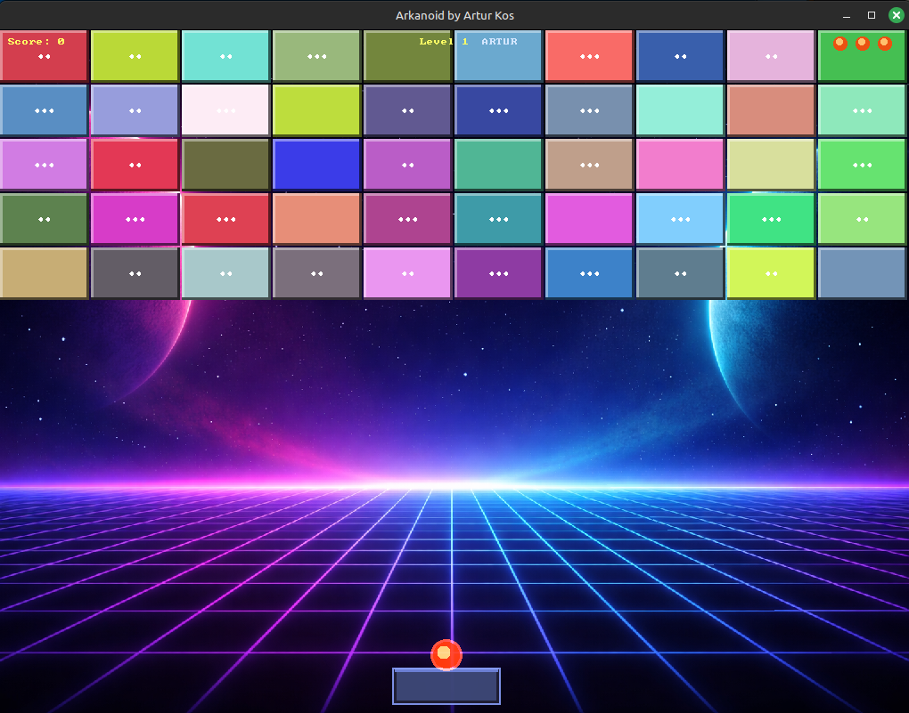
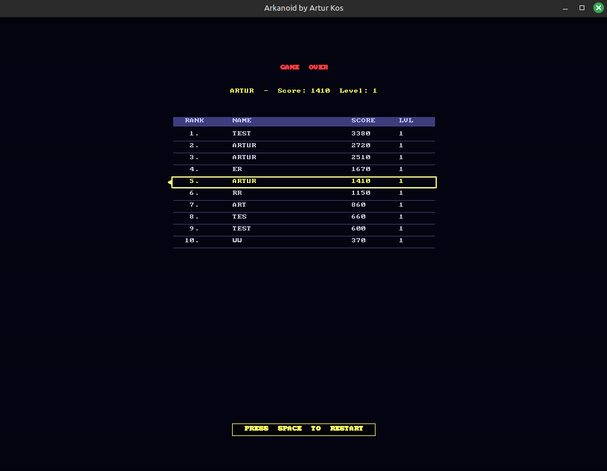
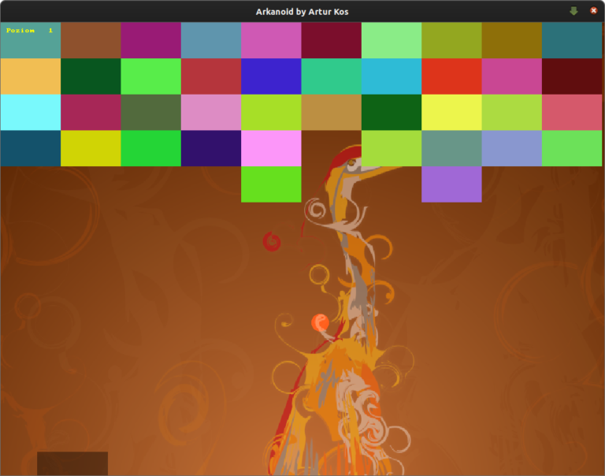

# Arkanoid

A classic brick-breaker game built with **C++** and **Allegro 5**, featuring power-ups, particle effects, a ball trail system, persistent high scores, and a retro CRT-styled intro screen.


## Demo Videos

### After AI Refactoring

[**Watch on YouTube**](https://youtu.be/-k9hkdu4cm8)

[](https://youtu.be/-k9hkdu4cm8)

### Legacy Version

[**Watch on YouTube**](https://youtu.be/IxjPidbq55g)

[](https://youtu.be/IxjPidbq55g)

## Screenshots

| Intro Screen | Gameplay | High Scores |
|:---:|:---:|:---:|
|  |  |  |



## Features

- **10x5 tile grid** with randomized colors and a multi-hit HP system (up to 3 HP per tile)
- **Beveled tile rendering** with highlight/shadow edges and visible crack lines as tiles take damage
- **HP indicator dots** displayed on multi-hit tiles so the player can gauge remaining durability
- **Five power-up types**: Wider paddle (W), Slow ball (S), Extra life (+), Multiball (M), and Fireball (F), with timed effects shown as duration bars in the HUD
- **Particle explosion system** with gravity, color variation, and fade-out when tiles are destroyed
- **Ball trail effect** rendering a fading tail behind the ball as it moves
- **Screen shake** triggered on tile destruction for visual impact
- **Sound effects** for paddle/wall bounces, tile hits and destruction, power-up pickup, life loss, level clear, and game over (retro-style WAV samples in `sounds/`; the game runs silently if audio is unavailable)
- **Persistent high scores** saved to `scores.dat` in binary format, displaying the top 10 entries with animated row fade-in
- **Retro CRT intro screen** with falling pixel-art title bricks, rainbow shimmer, starfield background, bouncing ball, and decorative bottom bricks
- **Name input screen** with blinking cursor and CRT scanline overlay
- **Level progression**: clearing all tiles advances to the next level; the first levels use hand-designed layouts loaded from `levels/NN.txt`, and once those run out the grid falls back to a randomized layout
- **Lives system** with 3 initial lives displayed as red circles in the HUD
- **Paddle angle control**: ball angle changes based on where it strikes the paddle (left third, center, right third)
- **Resizable window** with aspect-ratio-preserving scaling and fullscreen toggle (F key)

## Dependencies

| Library | Version | Purpose |
|---------|---------|---------|
| [Allegro 5](https://liballeg.org/) | >= 5.0 | Windowing, rendering, input, fonts, image loading, primitives |
| CMake | >= 3.2 | Build system |
| pkg-config | any | Allegro 5 detection |

### Installing dependencies

**Ubuntu / Debian:**
```bash
sudo apt-get install liballegro5-dev cmake pkg-config
```

**Arch Linux:**
```bash
sudo pacman -S allegro cmake pkgconf
```

**Fedora:**
```bash
sudo dnf install allegro5-devel cmake pkg-config
```

## Building

```bash
git clone https://github.com/ArturKos/arkanoid.git
cd arkanoid
cd build
cmake ..
make -j$(nproc)
```

## Running

Run from inside `build/`, where the assets (`background.png`, `sounds/`,
`levels/`) live:

```bash
./arkanoid
```

High scores are saved per-user to `$XDG_DATA_HOME/arkanoid/scores.dat`
(falling back to `~/.local/share/arkanoid/scores.dat`); delete that file to
reset the leaderboard.

## Installing

To install system-wide (for packaging or local use), build then run
`make install`. Assets go to `<prefix>/share/arkanoid` and the binary looks
them up there when they are not found in the working directory:

```bash
cd build
cmake -DCMAKE_INSTALL_PREFIX=/usr ..
make -j$(nproc)
sudo make install
```

This installs the `arkanoid` binary, its data files under
`/usr/share/arkanoid`, and a `arkanoid.desktop` menu entry. Use `DESTDIR` to
stage into a packaging root (e.g. `make install DESTDIR=/tmp/pkg`).

## How to Play

1. **Intro screen** -- Watch the animated title or press SPACE to start
2. **Enter your name** -- Type your name (up to 16 characters) and press ENTER
3. **Launch the ball** -- Press SPACE to release the ball from the paddle
4. **Break all tiles** -- Move the paddle to bounce the ball and destroy the 10x5 grid
5. **Collect power-ups** -- Catch falling capsules with the paddle for temporary bonuses
6. **Advance levels** -- Clearing all tiles generates a new randomized grid
7. **Game over** -- Lose all 3 lives to see the high score table; press SPACE to restart

### Controls

| Action | Input |
|--------|-------|
| Move paddle left/right | Left / Right arrow |
| Move paddle up/down | Up / Down arrow (lower half of screen) |
| Launch ball | Space |
| Pause / resume | P |
| Toggle fullscreen | F |
| Quit | Escape |

### Power-ups

| Type | Label | Effect | Duration |
|------|-------|--------|----------|
| Wider paddle | W (green) | Increases paddle width from 3x to 4.5x | 600 frames |
| Slow ball | S (blue) | Halves ball speed | 600 frames |
| Extra life | + (red) | Adds one life immediately | Instant |
| Multiball | M (purple) | Spawns extra balls diverging from the current ball (capped at 6 on screen) | Instant |
| Fireball | F (orange) | Ball burns through tiles without bouncing, destroying them in one pass | 600 frames |

Power-ups have a 25% drop chance when a tile is destroyed. Active power-up timers are displayed as progress bars in the top-left HUD.

## Custom levels

Level layouts live in `levels/NN.txt` (relative to the working directory, e.g.
`build/levels/01.txt`). Each file is a **5-row by 10-column** grid of characters:

- `1`, `2`, `3` — a tile with that many hit points (capped at `MAX_TILE_HP`)
- `.` (or any other character) — an empty cell

Levels are loaded in order by number (`01.txt`, `02.txt`, …). The level whose
number matches the current stage is used; if no file exists for that stage, a
randomized grid is generated instead. Tile colors are randomized per game.

Example (`levels/01.txt`, a pyramid):

```
....11....
...1221...
..123321..
.12333321.
1233333321
```

### Creating your own level

1. Create a new file `levels/NN.txt` where `NN` is the two-digit stage number
   (e.g. `06.txt` becomes the sixth stage). Numbering should be contiguous —
   the first missing number falls back to a random grid for that stage and all
   stages beyond it.
2. Write exactly **5 lines** of **10 characters** each (rows top-to-bottom,
   columns left-to-right — matching the on-screen 10×5 brick grid).
3. Use `1`/`2`/`3` for a brick with that many hit points (a `3` brick must be
   hit three times), and `.` for an empty cell. Any character other than
   `1`–`9` is treated as empty, so spaces or `-` also work as gaps.
4. Save the file next to the executable (under `build/levels/` for the standard
   build) and start the game — no rebuild is needed, the layout is read at
   runtime when that stage begins.

Tips: keep at least one brick per file (an all-empty grid clears instantly), and
remember HP values above `MAX_TILE_HP` (currently 3) are clamped down.

## Scoring

| Event | Points |
|-------|--------|
| Hit a tile | +10 |
| Destroy a tile | +50 (bonus on top of hit) |

## Project Structure

```
arkanoid/
├── CMakeLists.txt          # Build configuration with Allegro 5 pkg-config + install rules
├── LICENSE                 # MIT license
├── README.md               # This file
├── arkanoid.desktop        # Desktop menu entry (installed to share/applications)
├── arkanoid.h              # Global constants (board size, speeds, power-up config)
├── main.cpp                # Game loop, input handling, HUD drawing, paddle rendering
├── game_objects.h          # Ball, tile, tiles container, particle, power-up declarations
├── game_objects.cpp         # Ball physics, tile HP/rendering, collision detection,
│                           #   particle system, power-up spawning and collection
├── intro.h                 # Intro screen declaration
├── intro.cpp               # Animated pixel-art title, starfield, bouncing ball intro
├── scores.h                # High score and name input declarations
├── scores.cpp              # Binary score file I/O, name prompt, game-over overlay
├── screen.h                # Off-screen buffer declarations
├── screen.cpp              # Resolution-independent rendering with aspect-ratio scaling
├── paths.h                 # Asset/user-data path resolution declarations
├── paths.cpp               # FHS-aware path lookup (data dir vs XDG user dir)
├── audio.h / audio.cpp     # Sound effect loading and playback
├── tools/gen_sounds.py     # Procedural WAV sound generator
└── build/                  # Build directory; also holds runtime assets
    ├── background.png      #   background image
    ├── sounds/             #   generated WAV sound effects
    └── levels/             #   hand-designed level layouts
```

## License

Released under the [MIT License](LICENSE) — see the `LICENSE` file for the full
text. Copyright (c) 2026 Artur Kos.

---

**Author:** Artur Kos
